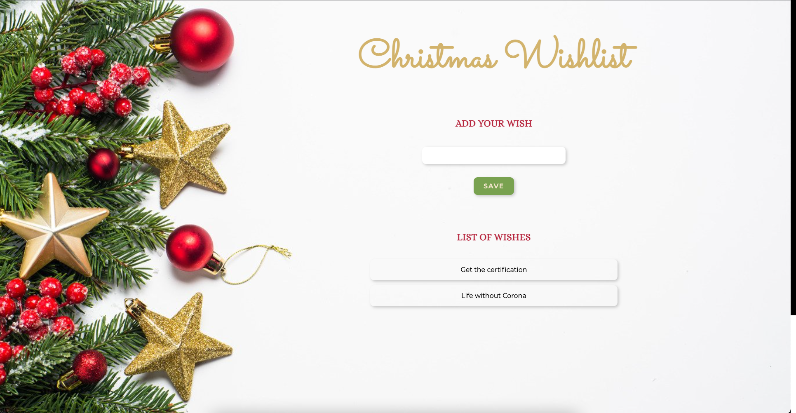

# Christmas Wishlist

Basic React training app with small Christmas twist :) The

## Prerequisits

- Nodejs (if you do not have it, [download](https://nodejs.org/en/download/))

## Setup

1. Clone repository
2. ```
   cd <your-repository-name>
   npm install
   ```
3. ```
   npm start
   ```
4. Enjoy

</br>


