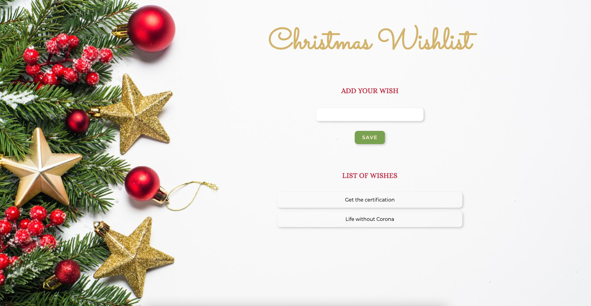

# Christmas Wishlist

Basic React training app with small Christmas twist :) The app use local storage, so the wishlist is persistent :)

Try a [live version](https://alice-rez.github.io/Christmas-Wishlist/) or Setup locally.

## Local setup:

1. Prerequisits: Nodejs (if you do not have it, [download](https://nodejs.org/en/download/))
2. Clone repository
3. ```
   cd <your-repository-name>
   npm install
   ```
4. ```
   npm start
   ```
5. Enjoy

</br>


